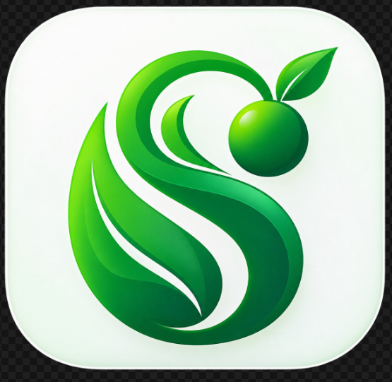

<div align="center">
  

  # 🌿 SkyFresh E-Commerce & Fresh Produce App

  **A Premium Digital Grocery Experience**

  [](https://flutter.dev/)
  [](https://nodejs.org/)
  [](https://expressjs.com/)
  [](https://www.mongodb.com/)
  [](https://reactjs.org/)

  <p align="center">
    A centralized full-stack mobile application designed to digitize premium grocery shopping, replacing traditional local shopping with a secure, highly responsive digital platform.
  </p>
</div>

---

## 🌟 Overview

**SkyFresh** is an all-in-one ecosystem for fresh produce shopping. It bridges the gap between premium quality local produce and digital convenience. The system enables users to intuitively browse fresh produce, manage their cart, filter items in real-time, maintain delivery addresses, and track order history through a unified mobile interface, complemented by a robust administrative dashboard.

## ✨ Key Features

### 🛍️ Customer Mobile App (Flutter)
- **Smart Catalog**: Browse curated product catalogs (Fruits, Juices, Fresh Cuts).
- **Real-time Search & Filter**: Find exactly what you need instantly.
- **AI Shopping Assistant**: Get personalized recommendations and assistance.
- **Seamless Cart Management**: Update quantities and review your basket with ease.
- **Order & Address Tracking**: Manage delivery addresses and view complete order history.
- **Real-time Notifications**: Stay updated on order statuses and offers.

### 🛡️ Admin Dashboard (React)
- **User Management**: Control and oversee user profiles securely.
- **Product Catalog Management**: Add, update, or remove inventory effortlessly.
- **Operational Analytics**: View sales dashboards and fulfillment metrics.
- **Order Monitoring**: Track order life-cycles from placement to delivery.

### 🔐 Secure Architecture
- **JWT-Based Authentication**: Ensuring robust and scalable user sessions.
- **Role-Based Access Control**: Strict segregation between Admin and Customer roles.
- **Persistent Sessions**: Powered by SharedPreferences on mobile.
- **OTP Verification Ready**: For enhanced security workflows.

---

## 🛠 Technology Stack

### Mobile Application (Frontend)
- **Framework**: [Flutter](https://flutter.dev/) / Dart
- **State Management**: Provider
- **Local Storage**: SharedPreferences
- **Design System**: Material Design Theme
- **Networking**: HTTP

### Administrative Web App
- **Framework**: [React.js](https://reactjs.org/)
- **Styling**: Responsive CSS/UI Libraries

### Backend Services
- **Runtime**: [Node.js](https://nodejs.org/)
- **Framework**: Express.js
- **Database**: MongoDB & Mongoose
- **Security**: bcrypt, JWT, CORS

---

## 📁 Project Architecture

The monorepo is thoughtfully structured to separate concerns while maintaining a unified ecosystem:

<details>
<summary><b>Click to expand the project structure</b></summary>

```text
SkyFresh/
├── skyfresh-frontend/    # Mobile Application (Flutter)
│   ├── android/
│   ├── ios/
│   ├── lib/
│   │   ├── models/       # Data structures
│   │   ├── screens/      # UI Views
│   │   ├── widgets/      # Reusable UI components
│   │   ├── api_service.dart
│   │   ├── cart_provider.dart
│   │   └── main.dart
│   └── pubspec.yaml
│
├── skyfresh-backend/     # Server Application (Node.js/Express)
│   ├── controllers/      # Business logic
│   ├── middleware/       # Auth & validation
│   ├── models/           # Mongoose schemas
│   ├── routes/           # API endpoints
│   ├── server.js         # Entry point
│   └── package.json
│
└── skyfresh-admin/       # Web Dashboard (React)
    ├── public/
    ├── src/
    │   ├── components/
    │   ├── pages/
    │   ├── config.js
    │   └── App.js
    └── package.json
```
</details>

---

## 🚀 Getting Started

### Prerequisites
- [Flutter SDK](https://flutter.dev/docs/get-started/install) (latest stable)
- [Node.js](https://nodejs.org/en/download/) (v16+)
- [MongoDB](https://www.mongodb.com/try/download/community) (Local or Atlas)
- npm or yarn

### Installation & Execution

1. **Clone the repository**
   ```bash
   git clone https://github.com/your-username/SkyFreshApp.git
   cd SkyFreshApp
   ```

2. **Run Backend Server**
   ```bash
   cd skyfresh-backend
   npm install
   npm start
   ```

3. **Run Admin Dashboard**
   ```bash
   cd ../skyfresh-admin
   npm install
   npm start
   ```

4. **Run Mobile Application**
   ```bash
   cd ../skyfresh-frontend
   flutter pub get
   flutter run
   ```

---

<div align="center">
  <p>Built with ❤️ by Yashvanth! :)</p>
</div>
